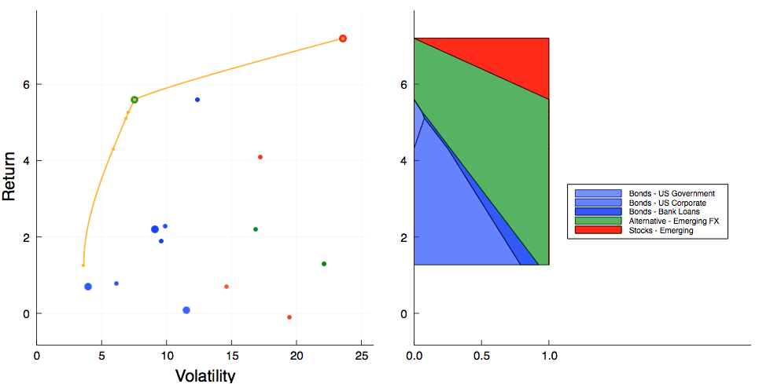
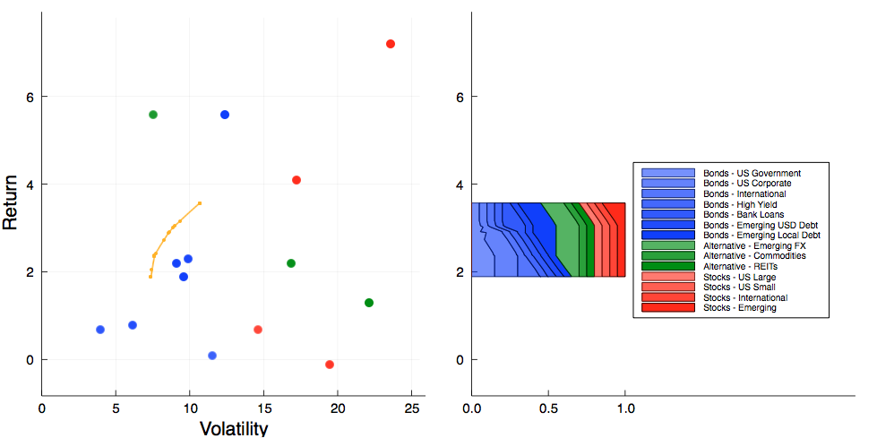
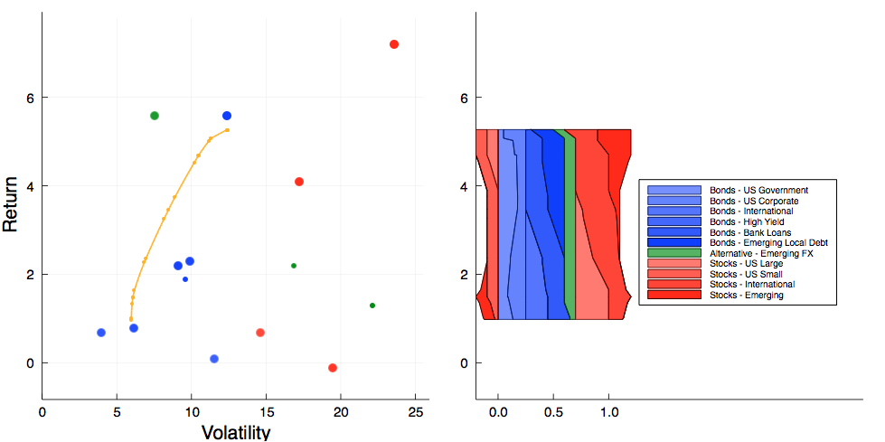

# Markowitz

## Overview

Solves the mean-variance optimization problem using the Critical Line Algorithm developed by Harry Markowitz.
A description of the algorithm is available in his 1959 monograph [Portfolio Selection](http://cowles.yale.edu/sites/default/files/files/pub/mon/m16-all.pdf).
This implementation is based on the 2000 edition of the book [Mean-Variance Analysis in Portfolio Choice and Capital Markets](https://books.google.ch/books?id=eJ8QUsgfZ8wC) by Markowitz and Todd.

## Installation

````julia
Pkg.clone("https://github.com/ungil/Markowitz.jl.git")
````

## Getting started

See examples/frontier.jl

````julia
m = markowitz(E, V, names=assets)
unit_sum(m) # total weight = 100%
f=frontier(m)
plot_frontier()
optimal(f) # volatility, return and weights for the minimum variance portofolio
optimal(f,4) # volatility, return and weights for the optimal portofolio with return = 4
````



````julia
m=markowitz(E, V, names=assets, lower=0.05, upper=0.15) # min 5%, max 15% per position
unit_sum(m)
f=frontier(m)
plot_frontier()
````



````julia
m=markowitz(E, V, names=assets, #  asset bounds by class: eq -10/30, fi 0/20, alt 0/10
            lower = -0.1 * (class .== :EQ),

upper = 0.3 * (class .== :EQ) + 0.2 * (class .== :FI) + 0.1 * (class .== :ALT))
unit_sum(m)
add_constraint(m, 1 * (class .== :EQ), '>', 0.3) # net equity exposure between 30% and 60%
add_constraint(m, 1 * (class .== :EQ), '<', 0.6)
add_constraint(m, [1 1 0 0 0 0 0 0 0 0 0 0 0 0], '=',0.25) # US govt + Investment Grade = 25%
f=frontier(m)
plot_frontier()
````


